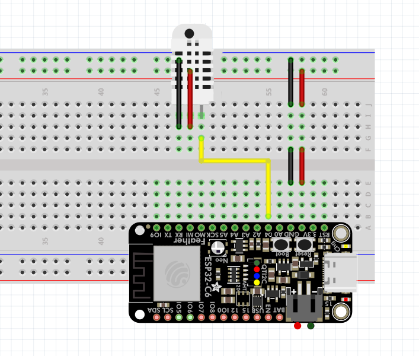

# 🌡️ Smart Environment Monitor — IoT Cloud Dashboard

The Smart Environment Monitor is a full-stack IoT system that collects real-time ambient temperature and humidity data using an ESP32 microcontroller and a DHT11 sensor, then streams the readings to Firebase Realtime Database over a secured Wi-Fi connection. A cross-platform mobile application built with React Native (Expo) continuously polls the cloud database and presents the live sensor data to the user through an interactive dashboard. The system supports historical data visualization through line charts and hourly heatmaps, allowing users to identify trends across configurable time windows (1 hour, 24 hours, 7 days, or all available history). Users can define custom temperature and humidity threshold ranges directly inside the app, and receive local push notifications when conditions exceed those limits — with a configurable cooldown period to prevent alert fatigue.

This project demonstrates the full IoT pipeline: from hardware sensing and Wi-Fi connectivity, through cloud storage with structured security rules, to a polished mobile interface with real-time feedback and user-defined alerting.

---

## 🎥 Demo

*(Upload your demo video to Teams and link it here)*

---

## 🔌 Schematics



---

## 📦 Pre-requisites

### Hardware Components

- **ESP32 Development Board (ESP-32S WiFi)**  
  https://www.espressif.com/en/products/socs/esp32

- **DHT11 Temperature and Humidity Sensor Module**  
  https://arduinogetstarted.com/tutorials/arduino-dht11

- **Breadboard**  
  https://busboard.com/BB830T

- **Jumper Wires (Male-Male / Male-Female)**  
  https://iotzone.in/blog/jumper-wire-types-uses-pin-configuration-and-complete-guide-for-electronics-projects

---

### Software Components

#### Firmware

- **Arduino IDE**  
  https://www.arduino.cc/en/software/

- **ESP32 Board Package (Espressif Systems)**  
  https://docs.espressif.com/projects/arduino-esp32/en/latest/installing.html

- **DHT Sensor Library (Adafruit)**  
  https://www.arduinolibraries.info/libraries/dht-sensor-library

- **Adafruit Unified Sensor Library**  
  https://docs.arduino.cc/libraries/adafruit-unified-sensor/

- **ArduinoJson by Benoit Blanchon (v6.x)**  
  https://arduinojson.org/

#### Cloud

- **Firebase Realtime Database**  
  https://firebase.google.com/products/realtime-database

#### Mobile App

- **Node.js (v18+)**  
  https://nodejs.org/

- **Expo SDK (v54)**  
  https://docs.expo.dev/

- **Expo Go** (for running on a physical device without a build)  
  https://expo.dev/go

- **react-native-chart-kit** — line charts and data visualization  
  https://github.com/indiespirit/react-native-chart-kit

- **expo-notifications** — local push notifications  
  https://docs.expo.dev/versions/latest/sdk/notifications/

- **@react-native-async-storage/async-storage** — persistent threshold settings  
  https://react-native-async-storage.github.io/async-storage/

---

## ⚙️ Setup and Build

### 1. Firebase Setup (Cloud)

1. Go to [Firebase Console](https://console.firebase.google.com/) and create a new project.
2. Navigate to **Build → Realtime Database** and click **Create Database**.
3. Choose a region (e.g. `europe-west1`) and start in **Test mode** for development.
4. Copy your database URL — it looks like:  
   `https://YOUR_PROJECT_ID-default-rtdb.europe-west1.firebasedatabase.app`
5. Go to **Realtime Database → Rules** and replace the existing rules with the contents of `cloud/firebase-database-rules.json` from this repository.

---

### 2. Install ESP32 Board Support

1. Open Arduino IDE.
2. Go to **File → Preferences**.
3. In **Additional Board Manager URLs**, add:  
   `https://raw.githubusercontent.com/espressif/arduino-esp32/gh-pages/package_esp32_index.json`
4. Go to **Tools → Board → Boards Manager**.
5. Search for **esp32** and install **ESP32 by Espressif Systems**.

---

### 3. Install Required Arduino Libraries

Open **Sketch → Include Library → Manage Libraries** and install the following:

- **DHT sensor library** — by Adafruit
- **Adafruit Unified Sensor** — by Adafruit
- **ArduinoJson** — by Benoit Blanchon (v6.x)

---

### 4. Hardware Connections

#### ⚡ Power Rails
- ESP32 **3.3V** → Breadboard **+** rail  
- ESP32 **GND** → Breadboard **−** rail

#### 🌡️ DHT11 Temperature & Humidity Sensor
| DHT11 Pin | Connects to |
|-----------|-------------|
| VCC       | + rail (3.3 V) |
| GND       | − rail |
| DATA      | GPIO **4** |

---

### 5. Configure the Firmware

1. Open `firmware/esp32_temp_humidity/esp32_temp_humidity.ino` in Arduino IDE.
2. Edit the **EDIT THESE VALUES** section at the top of the file:

```cpp
#define WIFI_SSID        "your_network_name"
#define WIFI_PASSWORD    "your_network_password"
#define FIREBASE_HOST    "https://YOUR_PROJECT_ID-default-rtdb.europe-west1.firebasedatabase.app"
#define FIREBASE_AUTH    ""          // leave empty if rules are open
```

3. If you are using a **DHT22** instead of a DHT11, change:

```cpp
#define DHT_TYPE DHT22
```

---

### 6. Upload the Firmware

1. Connect the ESP32 to your computer via USB.
2. In Arduino IDE, go to **Tools → Board** and select **ESP32 Dev Module**.
3. Go to **Tools → Port** and select the correct COM port.
4. Click **Upload** (→ arrow button).
5. If the upload does not start, hold the **BOOT** button on the ESP32 until uploading begins.

---

### 7. Configure the Mobile App

1. Navigate to the `mobile/` folder.
2. Copy the example config file:

```bash
cp mobile/src/config.example.ts mobile/src/config.ts
```

3. Open `mobile/src/config.ts` and set your Firebase URL and sensor path to match the firmware:

```ts
export const FIREBASE_HOST = "https://YOUR_PROJECT_ID-default-rtdb.europe-west1.firebasedatabase.app";
export const SENSOR_PATH   = "sensors/esp32-01";
```

---

### 8. Install Mobile App Dependencies

```bash
cd mobile
npm install
```

---

## ▶️ Running

### Running the Firmware

1. After uploading, the ESP32 starts automatically.
2. Open **Serial Monitor** in Arduino IDE at baud rate **115200**.
3. You should see the board connect to Wi-Fi, sync NTP time, and then output readings every 30 seconds:

```
Connecting to WiFi: your_network_name
WiFi connected. IP: 192.168.x.x
NTP time synced (UTC)
Sensor: 24.5 C, 48.0 %
Firebase POST /history -> 200 | {"deviceId":"esp32-01","temperature":24.5,"humidity":48.0,"timestamp":1747343400}
Firebase PUT /current -> 200 | ...
```

---

### Running the Mobile App

1. Make sure your phone and computer are on the **same Wi-Fi network** (LAN mode).
2. Start the Expo development server:

```bash
cd mobile
npm start
```

3. A QR code will appear in the terminal.
4. On Android, open the **Expo Go** app and scan the QR code.  
   On iOS, scan the QR code with the **Camera** app, which will open Expo Go.
5. The app will load on your device.

---

### Using the App

Once the app is running:

1. **Dashboard tab** — shows the latest temperature and humidity readings from Firebase, a live history chart, and a list of recent readings.
2. **Statistics tab** — shows min/avg/max values for selectable time windows (1H / 24H / 7D / ALL) and hourly heatmaps.
3. **Settings (gear icon)** — configure temperature and humidity alert thresholds and a cooldown period to avoid repeated notifications.
4. **Pull down** to manually refresh the data at any time; the app also polls Firebase automatically every **5 seconds**.
5. **Push notifications** are sent when a sensor reading crosses a configured threshold. A dot indicator appears on the Statistics tab to flag active threshold violations.

---

## 📊 Project Features

- Real-time temperature and humidity monitoring via DHT11 + ESP32
- Cloud sync to Firebase Realtime Database (every 30 seconds)
- Mobile dashboard with live metrics and history line chart
- Statistics screen with time-window filtering and hourly heatmaps
- User-defined threshold alerts with local push notifications and configurable cooldown
- Persistent settings stored on-device with AsyncStorage
- Non-blocking Wi-Fi management and NTP time synchronization on the ESP32

---

## 🚀 Future Improvements

- Authenticated Firebase access (Firebase Auth or signed tokens)
- Multiple device support and device selection in the app
- RGB LED indicator on the hardware for at-a-glance status
- Cloud data export (CSV / JSON)
- Use of a more accurate sensor (DHT22 or SHT31)
